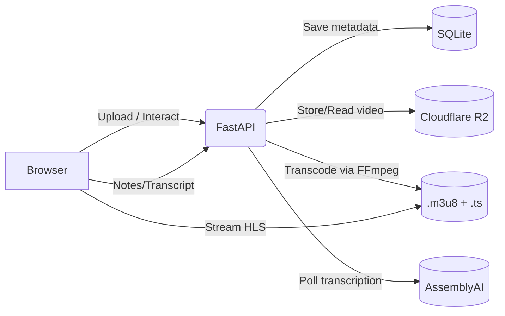

# Public Speaking Coach

A FastAPI + Jinja2 application that helps you self-review public speaking. Upload a speech video, then analyze:
1) Audio Image (voice, pace, filler words)
2) Video Image (body language, presence)
3) Text (auto-transcribed content)
4) Final Report (consolidated notes)

<TableOfContents />

## Introduction

Public Speaking Coach streamlines deliberate practice. It guides you through three focused passes: listening without visuals, watching without audio, and reviewing the transcript, so you can capture structured notes and produce an actionable report. Videos are stored locally in development or in Cloudflare R2 in production, transcoded to HLS for smooth streaming, and optionally auto-transcribed via AssemblyAI.

<Callout type="info">
This project emphasizes clarity and maintainability: small modules, simple templates, and explicit background jobs for transcoding and transcription.
</Callout>

## Key Features

- Guided analysis flow with saved notes per step
- Drag-and-drop upload with progress UX
- HLS streaming for robust playback
- Optional Cloudflare R2 storage with presigned-URL access
- Optional AssemblyAI transcription with polling
- Auto-seeded prompts for video/audio/text review
- Final report view aggregating your insights

## Architecture Overview

- Backend: FastAPI for pages and JSON APIs
- Templates: Jinja2 with Alpine.js for interactivity
- Database: SQLite with foreign keys and CASCADE
- Storage: Local filesystem (dev) or Cloudflare R2 (prod)
- Media: FFmpeg for preprocessing and HLS
- Transcription: AssemblyAI SDK with polling

See also: [`ARCHITECTURE.md`](ARCHITECTURE.md)



## Monorepo Layout

```bash
.
├─ app/
│  ├─ __init__.py
│  ├─ main.py
│  ├─ database.py
│  ├─ r2.py
│  ├─ seed_prompts.py
│  ├─ transcription.py
│  ├─ video_processing.py
│  ├─ templates/
│  │  ├─ base.html
│  │  ├─ index.html
│  │  ├─ audio.html
│  │  ├─ video.html
│  │  ├─ text.html
│  │  ├─ report.html
│  │  └─ sidebar.html
│  └─ static/
│     └─ css/style.css
├─ setup_database.py
├─ requirements.txt
├─ railway.json
├─ nixpacks.toml
├─ *.md (plans and docs)
└─ .env (local dev)
```

### Notable Modules

- [`app/main.py`](app/main.py): FastAPI app, routes, background tasks, page rendering, REST APIs
- [`app/database.py`](app/database.py): SQLite connection + schema creation
- [`app/r2.py`](app/r2.py): Cloudflare R2 client, upload/download, presigned URLs
- [`app/video_processing.py`](app/video_processing.py): FFmpeg preprocessing and HLS transcoding
- [`app/transcription.py`](app/transcription.py): AssemblyAI integration and polling
- [`app/seed_prompts.py`](app/seed_prompts.py): Initial prompt seeding
- [`setup_database.py`](setup_database.py): One-time init for DB, prompts, directories
- Templates in app/templates: Jinja2 views (audio, video, text, report)
- Static styles in app/static/css/style.css

## Installation

<details>
<summary>Local Development</summary>

1) Prerequisites
- Python 3.10+
- FFmpeg installed and on PATH

2) Clone and install
```bash
python -m venv .venv
# Windows
.venv\Scripts\activate
# macOS/Linux
source .venv/bin/activate

pip install -r requirements.txt
```

3) Initialize DB and folders
```bash
PYTHONPATH=. python setup_database.py
```

4) Run server
```bash
uvicorn app.main:app --reload
```

5) Open http://localhost:8000
</details>

<details>
<summary>Railway Deployment</summary>

- Railway uses [`railway.json`](railway.json:3) to run:
  ```bash
  PYTHONPATH=. python setup_database.py && uvicorn app.main:app --host 0.0.0.0 --port $PORT
  ```
- Nixpacks installs ffmpeg via [`nixpacks.toml`](nixpacks.toml:3)
- Configure environment variables in Railway dashboard (see next section).
</details>

## Environment Variables

Configure via .env (local) or Railway variables (production).

General
- DATABASE_URL=sqlite:///./app.db
- BASE_URL=http://localhost:8000

Cloudflare R2 (optional but recommended in production)
- CLOUDFLARE_R2_ENDPOINT=
- CLOUDFLARE_R2_ACCESS_KEY=
- CLOUDFLARE_R2_SECRET_KEY=
- CLOUDFLARE_R2_BUCKET_NAME=

AssemblyAI (optional for auto transcription)
- ASSEMBLYAI_API_KEY=

<Callout type="warning">
If R2 is not configured, files are saved locally to ./uploads and HLS outputs to ./hls_playlists. In production, prefer R2 to avoid ephemeral disk issues.
</Callout>

## Usage

1) Upload a video on the home page. Supported types: mp4, mov, avi, webm. Size limit enforced in backend.
2) After upload:
   - A background task transcodes to HLS
   - You are redirected to the Audio Image step
3) Work through steps:
   - Audio Image: listen and take notes
   - Video Image: watch muted HLS playback and take notes
   - Text: click “Auto-Transcribe” (if configured) or paste your own transcript, then take notes
4) Finish & View Report: review consolidated notes

### Example: Upload Endpoint

```python
# Requires: from fastapi import UploadFile, File, BackgroundTasks
# Entrypoint: app
@app.post("/upload")
async def handle_upload(background_tasks: BackgroundTasks, file: UploadFile = File(...)):
    ...
```
See the full implementation in [`app.main.handle_upload()`](app/main.py:119).

### Example: Start Transcription

```python
@app.post("/api/video/{video_id}/start-transcription")
async def start_transcription(video_id: int, background_tasks: BackgroundTasks):
    ...
```
Full code: [`app.main.start_transcription()`](app/main.py:212).

### Example: Get Transcript Status

```python
@app.get("/api/video/{video_id}/transcript")
async def get_transcript(video_id: int):
    ...
```
Full code: [`app.main.get_transcript()`](app/main.py:283).

## API Reference

High-level endpoints:

Pages
- GET / — dashboard and upload UI
- GET /audio/{video_id} — audio-pass analysis
- GET /video/{video_id} — video-pass analysis (HLS)
- GET /text/{video_id} — transcript review
- GET /report/{video_id} — consolidated report

REST APIs
- POST /upload — upload video
- POST /api/notes — auto-save notes
- POST /api/transcript — save transcript text
- POST /api/video/{id}/start-transcription — begin transcription job
- GET /api/video/{id}/transcript — fetch transcript or processing status
- DELETE /api/video/{id} — delete video and related data
- GET /video-file/{id} — presigned redirect for R2 storage
- GET /health — healthcheck
- GET /test-db, /test-r2 — diagnostics

See specific implementations in:
- [`app.main.save_note()`](app/main.py:170)
- [`app.main.save_transcript()`](app/main.py:194)
- [`app.main.delete_video()`](app/main.py:243)
- [`app.main.get_video_file()`](app/main.py:325)

## Data Model

Created in [`app.database.create_tables()`](app/database.py:13)

Tables:
- videos: id, filename, original_filename, file_size, mime_type, upload_url, transcript, hls_playlist_url, transcription_status, created_at
- prompts: id, view_type, question, order_index, created_at
- notes: id, video_id, view_type, prompt_id, content, created_at, UNIQUE(video_id, prompt_id)

Prompts are auto-seeded by [`app.seed_prompts.seed_prompts()`](app/seed_prompts.py:10).

## Media Pipeline

1) Upload: Stream to R2 or save locally
2) Transcode: Background job converts to HLS via [`app.video_processing.transcode_to_hls()`](app/video_processing.py:79)
3) Playback: HLS player in [`app/templates/video.html`](app/templates/video.html:42)
4) Transcript: If enabled, AssemblyAI transcription started via [`app.main.start_transcription()`](app/main.py:212) and executed by [`app.main.submit_transcription_task()`](app/main.py:380)

<Callout type="tip">
If you need pre-normalization, see [`app.video_processing.preprocess_video()`](app/video_processing.py:8) and adapt the pipeline to encode then HLS-segment.
</Callout>

## Security and Privacy

- Private R2 bucket with presigned URLs for temporary access
- No user accounts by default; consider adding auth if deploying publicly
- SQLite for simplicity; migrate to managed DB for multi-user scenarios
- Uploaded media can be large; ensure quotas and retention policies

## Contributing

1) Fork and branch per feature
2) Keep modules under ~200 LOC where practical
3) Run locally and test uploads, HLS, and transcription flows
4) Submit PR with:
   - Summary of change
   - Testing notes
   - Any required ENV additions

Suggested improvements:
- Add authentication and per-user scoping
- Replace SQLite with Postgres in production
- Add unit tests and e2e smoke tests
- Progress UI for background tasks

## License

Specify your license here. If none chosen, consider MIT for open distribution.

```text
MIT License
Copyright (c) 2025 ...
Permission is hereby granted, free of charge, to any person obtaining a copy...
```

## Support & Contact

- Issues: GitHub Issues tab
- Ops: Railway service logs and /health endpoint
- Media processing: verify ffmpeg installed and HLS produced under ./hls_playlists
- Transcription: check ASSEMBLYAI_API_KEY and server logs

<Callout type="success">
You’re ready to practice, analyze, and improve your speaking. Upload your first video from the home page.
</Callout>
